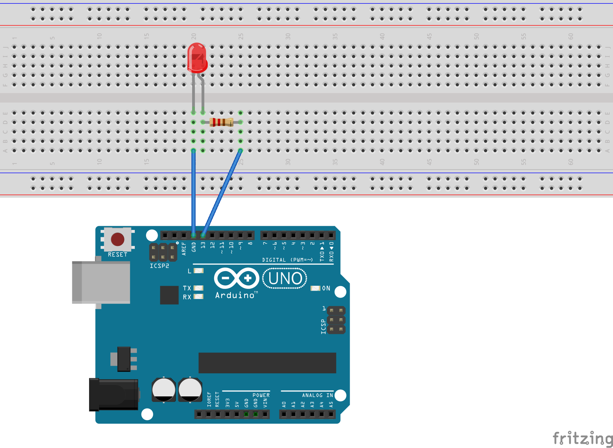

# 💡 Project 01: Blink LED

A foundational Arduino project that demonstrates basic LED control using both high-level Arduino functions and low-level AVR register manipulation. This project blinks the onboard LED (pin 13) on the Arduino Uno R3.

## 🎯 Learning Objectives

- Understand basic Arduino sketch structure (`setup()` and `loop()`)
- Learn GPIO pin configuration and digital output control
- Compare high-level Arduino functions vs. low-level register manipulation
- Introduction to timing delays and program flow control

## 🔧 Hardware Requirements

- **Arduino Uno R3** (Elegoo Super Starter Kit)
- **USB Cable** (for programming and power)
- **Computer** with Arduino IDE or arduino-cli

_Note: This project uses the built-in LED, so no external components are required._

## 📂 Project Structure

```
01-blink-led/
├── README.md                        # This documentation
├── ino/                            # Arduino sketch implementation
│   └── blink-led-ino.ino          # High-level Arduino code
├── cpp/                            # AVR C++ implementation
│   ├── blink-led-cpp.cpp          # Pure C++ with AVR registers
│   └── blink-led-cpp.ino          # Arduino-compatible wrapper
└── diagram/                        # Circuit diagrams
    ├── blink-led-breadboard.fzz   # Fritzing project file
    └── blink-led-breadboard.png   # Exported breadboard view
```

## 💻 Implementation Details

### Arduino Sketch (`ino/blink-led-ino.ino`)

- Uses `pinMode()`, `digitalWrite()`, and `delay()` functions
- Simple, readable code perfect for beginners
- Abstracts away hardware complexity

### AVR C++ (`cpp/blink-led-cpp.cpp`)

- Direct register manipulation using `DDRB` and `PORTB`
- Uses `_delay_ms()` for precise timing
- Demonstrates low-level microcontroller programming

## 🔌 Circuit Diagram

The circuit diagram shows the Arduino Uno R3 with the built-in LED connection. Although no external wiring is required, the diagram illustrates:

- **Pin 13** connection to onboard LED
- **LED polarity** and current limiting resistor (built-in)
- **Power connections** and USB programming interface



## 🚀 Getting Started

### Option 1: Arduino Sketch

```bash
# Navigate to the ino directory
cd ino/

# Compile and upload using arduino-cli
arduino-cli compile --fqbn arduino:avr:uno blink-led-ino.ino
arduino-cli upload -p /dev/cu.usbmodem* --fqbn arduino:avr:uno blink-led-ino.ino
```

### Option 2: AVR C++ (Advanced)

```bash
# Compile using avr-gcc (requires AVR toolchain)
avr-gcc -mmcu=atmega328p -DF_CPU=16000000UL -Wall -O2 -o blink-led.elf cpp/blink-led-cpp.cpp
avr-objcopy -O ihex blink-led.elf blink-led.hex

# Upload using avrdude
avrdude -F -V -c arduino -p ATMEGA328P -P /dev/cu.usbmodem* -b 115200 -U flash:w:blink-led.hex
```

## 📊 Expected Behavior

1. **LED ON** for 500ms
2. **LED OFF** for 3000ms (3 seconds)
3. **Repeat** indefinitely

The LED will continue blinking in this pattern until the Arduino is powered off or reset.

## 🔍 Code Comparison

| Feature         | Arduino Sketch                | AVR C++                          |
| --------------- | ----------------------------- | -------------------------------- |
| **Complexity**  | Beginner-friendly             | Advanced                         |
| **Code Size**   | Larger (abstraction overhead) | Smaller (direct register access) |
| **Performance** | Good                          | Optimal                          |
| **Readability** | High                          | Requires AVR knowledge           |
| **Portability** | Arduino ecosystem only        | Any AVR microcontroller          |

## 🎓 Next Steps

After mastering this project, consider exploring:

- External LED control with breadboard wiring
- Multiple LED patterns and sequences
- PWM for LED brightness control
- Button-controlled LED states

## 🐛 Troubleshooting

- **LED not blinking**: Check USB connection and board selection
- **Upload failed**: Verify correct port selection (`arduino-cli board list`)
- **Compilation errors**: Ensure arduino-cli and core are properly installed
